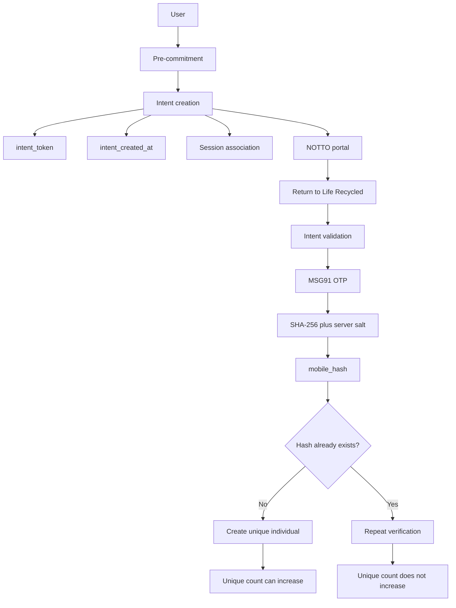

# Life Recycled
Life Recycled is a React web application for an organ-donation information and verification flow around the official Government of India NOTTO registration portal. The application records its own session, commitment, redirect, and verification-related events. It does not independently verify a user's NOTTO registration.

## Overview

The application provides:

- An attributed entry flow at `/pledge/:sourceId`
- Educational information and FAQs about organ donation
- A pre-commitment step before opening NOTTO
- A return flow using a server-stored intent token
- Mobile OTP verification through MSG91
- Hash-based unique-individual deduplication
- Aggregate verification and redirect metrics
- Methodology and privacy disclosures

## How It Works

1. A visitor enters through `/pledge/:sourceId`. The frontend asks the `session-manager` Edge Function to create a server-side session in the `sessions` table.
2. On the commitment page, the visitor confirms the displayed acknowledgements. The application opens `https://notto.abdm.gov.in/register` in a new tab.
3. After opening NOTTO, the browser asynchronously asks `session-manager` to commit the session and create an intent. The intent contains an `intent_id`, a server-generated `intent_created_at` timestamp, an opaque `intent_token`, the session and source IDs, and claim fields.
4. The returned intent token is stored in browser `localStorage`. The redirect is separately passed to `notto-redirect`, which records a `redirect_logs` row when possible.
5. When the visitor returns to `/verify`, the frontend reads the token and asks `session-manager` to validate that exact intent. The original frontend session is not required for this validation path.
6. The visitor enters a mobile number and completes OTP verification through the MSG91 Web SDK. The resulting access token, the client-submitted mobile number, and the intent token are sent to `verify-otp`.
7. `verify-otp` looks up the exact intent by token, checks its claim status and age, validates the MSG91 access token server-side, hashes the submitted mobile number, checks or inserts a unique individual, attempts to claim the intent, and updates the associated session.

NOTTO registration completion is not returned by NOTTO to this application and is not independently verified here. The application's verification confirms the Life Recycled flow and OTP step, not government registration status.

## Architecture



## Technical Architecture

### Frontend

- React 18, TypeScript, and Vite
- React Router routes defined in `src/App.tsx`
- Tailwind CSS, shadcn/ui, Radix UI, and Lucide React
- Client-side session state in `src/contexts/SessionContext.tsx`
- Supabase browser client in `src/integrations/supabase/client.ts`
- OTP orchestration in `src/hooks/useOTPVerification.ts` and `src/hooks/useMSG91Widget.ts`

The browser uses the Supabase publishable/anon configuration to invoke Edge Functions. The current frontend does not directly query application tables, use Supabase Storage, or use Supabase Auth.

### Backend

The backend is defined under `supabase/`:

| Function | Current responsibility |
| --- | --- |
| `session-manager` | Creates and commits sessions; creates and validates intents |
| `notto-redirect` | Validates a committed session and records a NOTTO redirect event |
| `get-widget-token` | Returns MSG91 widget configuration to the browser |
| `verify-otp` | Validates the MSG91 access token, hashes the submitted mobile, deduplicates, claims the intent, and updates the session |
| `get-metrics` | Counts rows in `unique_individuals` and `redirect_logs` |

The Edge Functions create Supabase clients with the server-side `SUPABASE_SERVICE_ROLE_KEY`. The key's value is not stored in this repository.

## Design Principles

- **Data minimization:** The application code stores a mobile hash for deduplication rather than the raw mobile number in its application tables.
- **Deterministic deduplication:** The same normalized mobile number and server-side salt produce the same SHA-256 hash, allowing repeat verification to be identified.
- **Explicit intent association:** Verification looks up the intent represented by the submitted token rather than selecting an intent by recency or ordering.
- **Separation of concerns:** Session management, intent handling, NOTTO redirect logging, OTP verification, deduplication, and metrics are implemented as separate operations.
- **Server-side checks:** Intent existence, claim status, and age are checked by Edge Functions before server-side MSG91 access-token validation.

## Intent System

An intent is created only after `create_intent` receives a valid committed session. It is distinct from the frontend session and represents the server-side record used to authorize a return verification attempt.

The intent token is generated from cryptographically secure random bytes using `crypto.getRandomValues`, represented as a 64-character hexadecimal value, and stored in `intents.intent_token`, which is unique in the local schema. Verification retrieves one specific intent with an equality lookup on that token. The implementation does not select the latest intent, the first unclaimed intent, or an intent based on timing, IP, or ordering.

The token is also stored under the single browser key `liferecycled_intent_token`. A later intent in the same browser origin can overwrite an earlier token, so same-browser multi-tab or multi-user isolation is not guaranteed.

## Verification and Deduplication

The server checks the submitted intent before contacting MSG91:

```text
intent token lookup
	 -> claimed check
	 -> 48-hour age check
	 -> MSG91 access-token verification
	 -> mobile normalization and SHA-256 hashing
	 -> unique-individual lookup/insert
	 -> intent claim attempt
	 -> associated session update
```

The hash is calculated server-side as:

```text
normalized mobile number + server-side secret salt
	 -> SHA-256
	 -> mobile_hash
```

The hash input in the current implementation does not include the intent ID, intent token, session ID, OTP, timestamp, randomness, browser data, device data, or IP address. With the same normalized mobile number and unchanged salt, the result is deterministic.

The `unique_individuals.mobile_hash` column is unique in the local schema:

- If the hash is absent, the function inserts a new `unique_individuals` row and returns `is_new_unique: true`.
- If the hash already exists, no second unique-individual row is inserted and the response returns `is_new_unique: false`.
- The frontend uses that response to show separate first-time and repeat-verification states.

The current server code hashes the mobile number supplied by the client after MSG91 access-token validation. It does not visibly extract and compare a verified mobile number from the MSG91 response. The codebase therefore does not establish that the hashed submitted number is the same identity represented by the MSG91 access token.

## 48-Hour Validity

`intents.intent_created_at` has a database default of `now()`. Both `session-manager` intent validation and `verify-otp` compare the stored timestamp with the current server time and reject an intent when its age is greater than 48 hours.

Expired intents are rejected before OTP verification. The frontend displays an expired state and offers a restart path. The current comparison does not explicitly reject a future-dated intent.

## NOTTO Redirect Tracking

Redirect tracking and verification are separate backend operations:

- `notto-redirect` validates the committed session and matching `source_id`.
- It allows at most one `redirect_logs` record per session through a unique database constraint.
- A previously logged redirect still returns the NOTTO URL without inserting another log.
- Redirect logging failure does not block the returned redirect response.

The browser opens NOTTO before the asynchronous commit, intent creation, and redirect logging operations complete. A backend failure can therefore leave a visitor with an opened NOTTO page but without a usable intent token.

## Metrics

`get-metrics` performs live exact-count queries with Supabase:

- `COUNT(unique_individuals)` is returned as `verifiedUniques`.
- `COUNT(redirect_logs)` is returned as both `totalCommitments` and `totalRedirects`.

The counts are not hardcoded or calculated at build time. The metrics endpoint returns aggregate counts rather than individual records.

## Database and RLS

Local migrations define these tables:

- `sessions`
- `intents`
- `redirect_logs`
- `unique_individuals`
- `otp_verifications`
- `mobile_otp_rate_limits`

RLS is enabled by the local migrations. Later migrations add restrictive deny policies for normal anonymous and authenticated access to sensitive tables. The Edge Functions use the Supabase service role for their server-side operations and therefore bypass normal RLS evaluation.

The current MSG91 OTP flow does not write to `otp_verifications` or `mobile_otp_rate_limits`; those tables exist in the local migration and generated type definitions. The deployed database state is not verifiable from this repository alone.

## Security and Privacy Model

| Data or event | Stored by Life Recycled application tables? | Purpose |
| --- | --- | --- |
| Raw mobile number | No raw mobile column is used by the current application flow | Input for OTP and hash generation |
| `mobile_hash` | Yes | Unique-individual deduplication and intent association |
| Intent token | Yes | Retrieve one specific intent during return verification |
| Session data | Yes | Track the attributed flow and state transitions |
| OTP value | No by the current application flow | OTP verification is handled through MSG91; the separate `otp_verifications` table is not used by this flow |
| NOTTO registration data | No | Registration occurs externally on the NOTTO portal |

## Privacy and Data Handling

- The raw mobile number is accepted in the `verify-otp` request and held in function memory while it is normalized and hashed.
- The application code inserts the resulting `mobile_hash`, not the raw mobile number, into `unique_individuals`.
- The hash is also stored on the claimed intent.
- Intent tokens, claim state, timestamps, session IDs, and source IDs are persisted.
- The current application OTP path does not persist OTP values; the separate `otp_verifications` schema includes an `otp_hash` column but is not used by this flow.
- The repository does not establish what infrastructure or third-party provider logs may retain.

## Known Limitations & Future Hardening

The following limitations are present in the current implementation:

1. **Non-atomic intent claiming:** The function reads `claimed`, performs MSG91 verification and deduplication, then performs a separate conditional update with `claimed = false`. Concurrent requests can both pass the initial check. The update result is not checked, claim errors are ignored, and both requests can return success.
2. **Submitted mobile is not visibly bound to MSG91 identity:** The server validates the access token but hashes the mobile value supplied in the request without a visible comparison to a phone value from MSG91.
3. **Shared browser token storage:** One `localStorage` key is used for all intents on the same origin. A later intent can overwrite an earlier token.
4. **Asynchronous post-redirect processing:** NOTTO opens before session commit, intent creation, and redirect logging finish. Failures are logged but are not presented as a blocking error to the user.
5. **No production-state guarantee:** The local codebase cannot verify deployed Supabase schema, function secrets, CORS settings, provider behavior, database records, or provider-side logs.

These limitations are disclosures of the current implementation.

Potential future hardening directions, not currently implemented, include:

- Atomic or transactional intent claiming and deduplication
- Stronger client-side intent-token isolation
- Explicit binding between the MSG91-verified identity and the mobile value used for hashing
- Additional database access hardening
- Optional anchoring of cryptographic hashes in an immutable external data architecture

## Future Roadmap

The current repository implements the intent, OTP, hash-deduplication, and live-metrics flow described above. Possible future directions, not implemented here, include:

- Stronger transactional verification guarantees
- Further database access hardening
- An immutable data architecture
- Optional blockchain anchoring of cryptographic hashes without placing raw mobile numbers on-chain

## Local Development

Requirements:

- Node.js
- npm
- A Supabase project configured for the Edge Functions
- Deployment-managed Supabase and MSG91 backend secrets

1. Install dependencies:

	```sh
	npm install
	```

2. Create a local `.env` file. It is ignored by Git and must not be committed. The browser client expects these variable names:

	```text
	VITE_SUPABASE_PROJECT_ID=<Supabase project ID>
	VITE_SUPABASE_URL=<Supabase project URL>
	VITE_SUPABASE_PUBLISHABLE_KEY=<Supabase anon/publishable key>
	```

3. Start the development server:

	```sh
	npm run dev
	```

The Vite configuration uses port `8080` by default.

Available scripts:

```sh
npm run dev
npm run build
npm run build:dev
npm run preview
npm run lint
npm test
npm run test:watch
```
